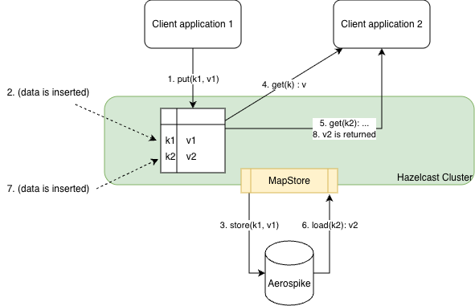

# Aerospike MapStore

Prototype of a Hazelcast MapStore for Aerospike.

## Data model

Aerospike's data model differs from Hazelcast's. It's then necessary to decide how to map keys and values of an IMap to an Aerospike data structure.

### 1 Aerospike record holding a CDT map

Shape:
- One Aerospike record: (namespace, set, recordKey)
- One bin with a CDT map: binName = { K → V }
- The IMap<K,V> is fully contained in that map.

When it makes sense:
- Small-ish maps (tens / hundreds / maybe a few thousands of entries), e.g.:
   - feature flags, config, routing tables, reference data
You always want the whole thing “in one go”:
   - global state, scoreboard, etc.
- Low write contention: you don’t have 100s of threads pounding the same record.

Pain points
- Single hot record → write contention & record size limits.
- `loadAllKeys()` requires reading that record anyway.
-Not good for “big” maps or very high write rates.

So: keep this for small control/config maps. For anything else, I’d consider other options.

Implementation: `com.hazelcast.fcannizzohz.mapstoredemo.AbstractAerospikeCdtMapStore` and `com.hazelcast.fcannizzohz.mapstoredemo.StringStringCdtMapStore`.

### 1 Hazelcast entry = 1 Aerospike record

This is usually the default choice.

Shape:
- One Aerospike set per Hazelcast map (simplest mental model):
    - Hazelcast map payments → Aerospike set payments
- Aerospike record key = Hazelcast map key
- Value = multiple bins in the record:
    - amount, currency, status, updatedAt, etc.

MapStore:
- load(K) → client.get() on that key
- store(K,V) → client.put() mapping V to bins
- delete(K) → client.delete()
- loadAll() / storeAll() → batch variants or loops

Pros
- Scales with data volume: Aerospike is designed for many records.
- You can:
   - index bins (secondary indexes),
   - use record-level TTL,
   - use generation-based CAS if you care about optimistic locking.
- Fits Hazelcast semantics very naturally.

Cons
- If you do “one set per map”, you might end up with many sets if you have lots of maps.
   - Alternate: one shared set with a mapName / type bin for multi-tenancy.

When to use
- Most “normal” business maps: customers, orders, sessions, payments, etc.
- When you want Aerospike as the “system of record” and Hazelcast as a cache / compute layer.

If you only implement one production pattern, it should be this one.

### Multi-bin records: store several Hazelcast maps in one Aerospike set

Useful when you have different IMaps keyed by the same key-space and want to co-locate them.

Shape

- One Aerospike set, e.g. user-data.
- Record key = logical user ID.
- Each Hazelcast map is a separate bin:
    - IMap<String,UserProfile> → bin profile
    - IMap<String,Preferences> → bin prefs
    - IMap<String,Flags> → bin flags 

MapStore
- For each map, MapStore:
    - load(K) → client.get(); read only its bin (record.getValue(binName)).
    - store(K,V) → client.put() with its bin only.
    - delete(K) → either:
       - clear only that bin (UDF/operate), or
       - delete the record if all bins are considered a unit.

Pros

- One Aerospike record per logical entity, all related data together.
- Easy to enforce row-level atomicity for multiple logical maps.

Cons

- Tighter coupling between maps.
- Deleting from one map may need shared conventions (tombstone vs clear bin vs delete record).
- Harder to evolve independently.

When to use

- You have multiple Hazelcast maps representing different “views” on the same entity and always use the same key-space (e.g. userId).

## Tests

They Require external community server to connect to.

```bash
docker run -d --name aerospike -p 3000-3002:3000-3002 aerospike/aerospike-server
```

## Sequence




